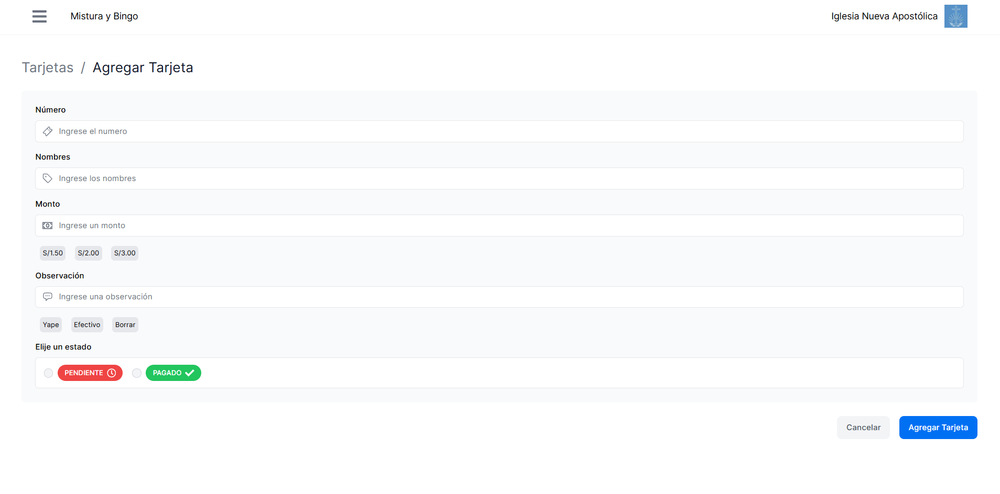
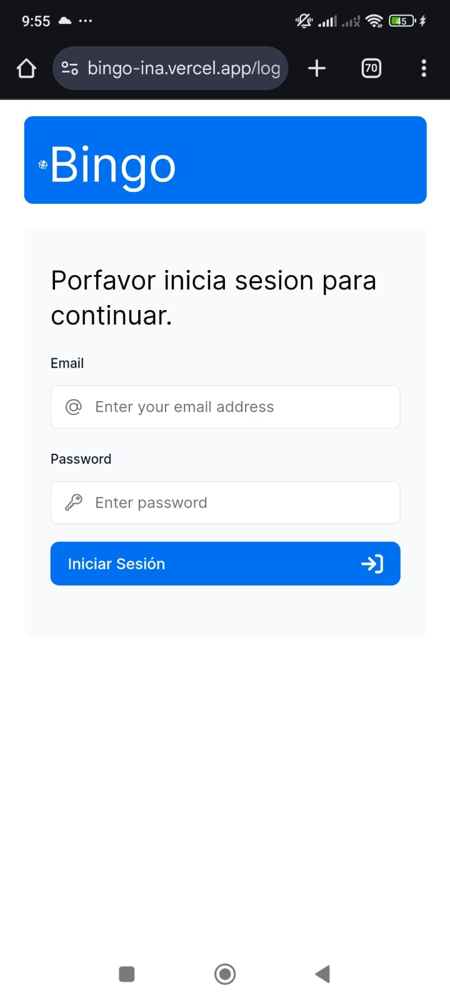
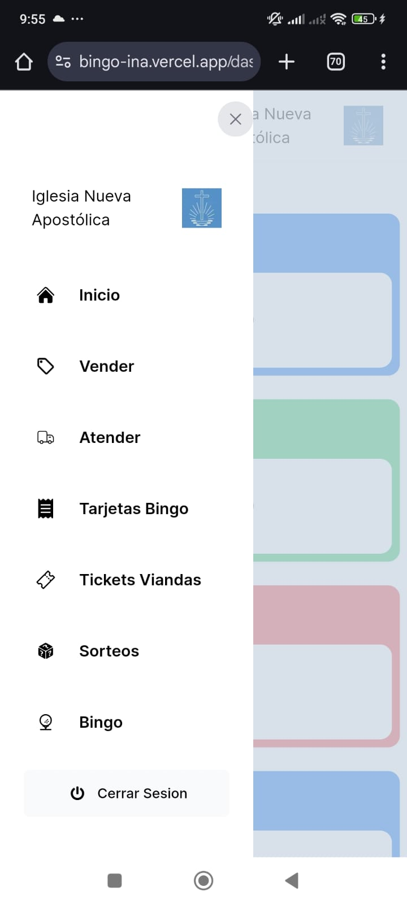

## Next.js App Bingo y Venta de Viandas

Este proyecto es una herramienta de gestión y atención de actividades en este caso Bingo y venta de tickets.

se puede previsualizar en [https://bingo-ina.vercel.app/](https://bingo-ina.vercel.app)

## Tecnologías
<table align="center">
  <tr>
    <td align="center">
      <a href="https://www.typescriptlang.org/">
         
        TypeScript
      </a>
    </td>
    <td align="center">
      <a href="https://nextjs.org/">
         
        Next.js
      </a>
    </td>
    <td align="center">
      <a href="https://www.postgresql.org/">
         
        PostgreSQL
      </a>
    </td>
    <td align="center">
      <a href="https://vercel.com/">
       
        Vercel
      </a>
    </td>
    
    
  </tr>
</table>

# Desktop

# Mobile

